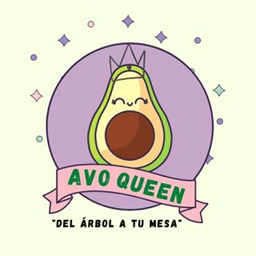

<p>
    <h1 align="center"> App para </h1>
    <h3 align="center">gestión AvoQueen</h3>
    <p align="center">
        
    </p>
</p>


<h2>Instalación:</h2>

1. Asegurate de tener [nodejs](https://nodejs.org/es/) instalado

2. En tu terminal clonar el proyecto con el comando 

```
git clone git@github.com:mortegac/avoqueen_app.git
```

3.- Una vez descargado a tu computador, encontrarás 2 carpetas

```
.
├── client
├── api
├── package.json
├── 
└── README.md

```
a).- **client** =  Carpeta donde se encuentra la aplicación en reactjs

b).- **api** =  Carpeta donde se encuentra la API


4.- Instalar las dependencia en cada carpeta y en la raiz del sitio

```
yarn install
cd server && yarn install
cd client && yarn install
```

5.- En la raíz de sitio se encuentra configurado un proyecto para que a través de un comando se ejecute ambos proyecto.

```
yarn start
```
